## Portfolio
This is a swocase of Arturo's recent projects:

## [Holiday Reporting system](https://github.com/apellicerep/tfg_/blob/master/README.md)

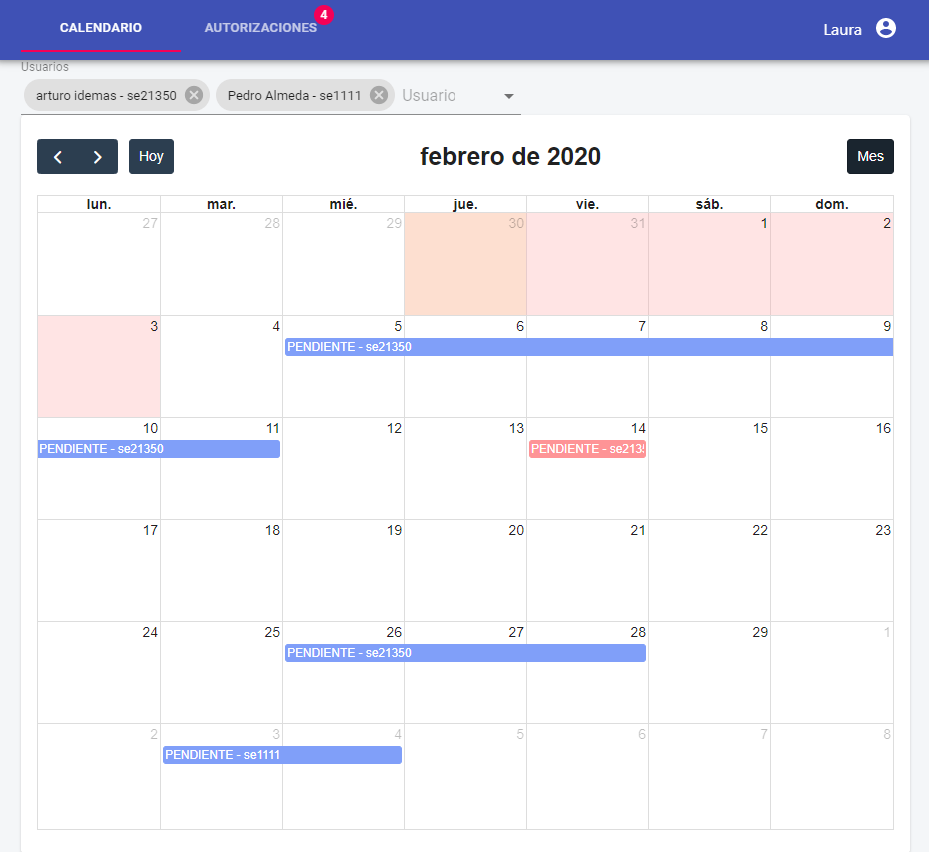
	
This project was born due to my universities need to have a customized holiday reporting system for their employers. To meet their needs and provide them with a software that only containd the requested features I built it and designed this software as my thesis. 

Some of the features:

* The software allows the administrator to register and manage the academic courses and the employers.
* The employers can add holiday requests, check requests status, keep track of amount of holiday days spent and holiday days left.
* The supervisor receive notifications when a request is made and can accept/decline the requests to plan so that the department always is manned.

Main Technologies:

* Front-End: React and Material-Ui
* Back-End: Express, MySql and Sequelize.

#### [Know More +](https://github.com/apellicerep/tfg_/blob/master/README.md)

---

## [Course Management system](https://github.com/apellicerep/Full-Stack-App-with-React-and-REST-API)

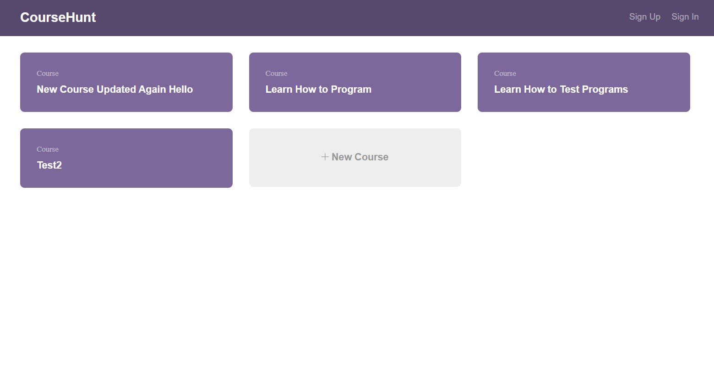

This is my last project(10th) that I've done during my training as a developer in the Teechdegree Fullstack Javascript.

In this Project I've used React to create a client for my existing school database REST API (the one that I created in previous project). The full stack application will provide a way for users to administer a school database containing information about courses: users can interact with the database by retrieving a list of courses, viewing detail for a specific course, as well as creating, updating and deleting courses in the database.

In addition, the project will require users to create an account and sign in to make changes to the database.

To complete this project, I've used my knowledge of React, JSX, React Router, React Context API, and Create React App.

I've used:

* JavaScript and JSX to build out the components.
* React Router to set up your routes.
* The Fetch API  to fetch data from your REST API.
* Allow users to sign up and use basic authentication to support users signing in.

#### [Know More +](https://github.com/apellicerep/Full-Stack-App-with-React-and-REST-API)

---

## [REST API](https://github.com/apellicerep/REST_Api)

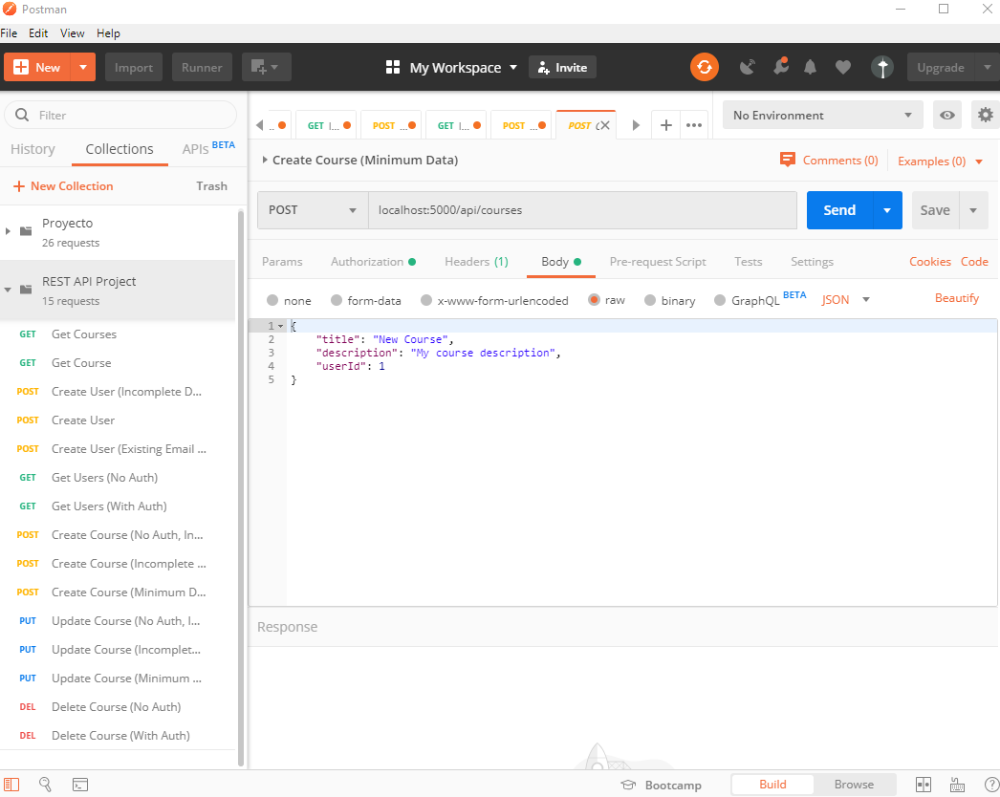

This is the 9th project that I've done during my training as a developer in the Teechdegree Fullstack Javascript.

In this project, I've created a REST API using Express. The API will provide a way for users to administer a school database containing information about courses: users can interact with the database by retrieving a list of courses, as well as adding, updating and deleting courses in the database.

In addition, the project will require users to create an account and log-in to make changes to the database.

I've used my knowledge of REST API design, Node.js, and Express to create:

* API routes
* Data modeling with Sequelize ORM
* Basic Authentication
* Validation
* Data persistence (SQL)
* Postman for testing the REST API.

In a future project, I'll complete a full stack JavaScript application by using React to create a client for this REST API.

#### [Know More +](https://github.com/apellicerep/REST_Api)

---

## [SQL Library Manager](https://github.com/apellicerep/SQL-LIBRARY-MANAGER)

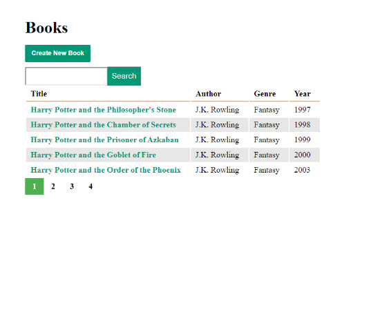

This is the 8th project that I've done during my training as a developer in the Teechdegree Fullstack Javascript.

Given HTML designs and an existing SQLite database. I have implemented a dynamic website using JavaScript, Node.js, Express, Pug, and the SQL ORM Sequelize that includes:

* Pages to list.
* Add, update, and delete books.
* Pagination 
* Search field.

#### [Know More +](https://github.com/apellicerep/SQL-LIBRARY-MANAGER)

---

## [React Gallery App](https://github.com/apellicerep/React-Gallery-App)

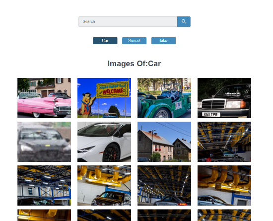

This is the 7th project that I've done during my training as a developer in the Teechdegree Fullstack Javascript.

For this project, I used the very popular UI Library React Js to create an image gallery app and using the powerful Create React App tool, I setted up the initial project.

I have done:

* Used JavaScript and JSX to build out the gallery components in a modular fashion.
* Used React Router to set up routes for three default topic pages and a search page.
* Used the tool Axios to fetch data from the Flickr API and use it to display images in the app.
* Add logic to handle the search input.

This project was bootstrapped with Create React App.
#### [Know More +](https://github.com/apellicerep/React-Gallery-App)

---

## [Express Portfolio](https://github.com/apellicerep/Express-Js-Portfolio)

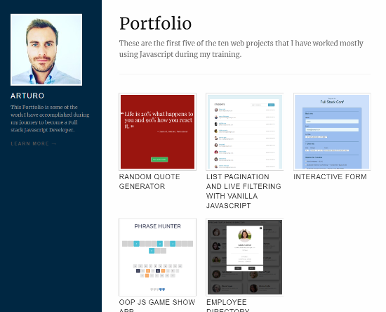

This is the 6th project that I've done during my training as a developer in the Teechdegree Fullstack Javascript.

In this project, I created a portfolio site to showcase the projects that I've builted. I have used  Node.js and Express to

I create a JSON file to store all the data about the projects I have created.

I've used Pug to complete the provided templates that utilize the JSON to generate the markup that is ultimately displayed in the browser.

I used Nodejs and Express to:

* Import the required dependencies
* Link the JSON with the Pug templates
* Set up routes to handle requests
* Set up the middleware to utilize static files like CSS
* Handle errors
* Set up a server to serve the project

#### [Know More +](https://github.com/apellicerep/Express-Js-Portfolio)

---

## [Employee Directory](https://github.com/apellicerep/Employee_Directory_JS)

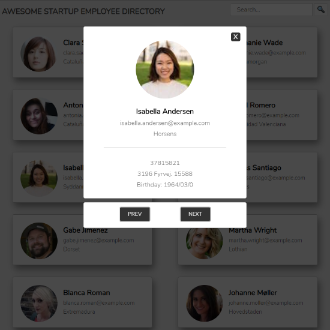

This is the 5th project that I've done during my training as a developer in the Teechdegree Fullstack Javascript.

For this project, I've coded all the Javascript logic for a fictional company called Awesome Startup, a distributed company with remote employees working all over the world. They need a smart way for employees to share contact information with each other.

I used the Random User Generator API (https://randomuser.me/) to grab information for 12 random “employees,” and use that data to build a prototype for an Awesome Startup employee directory.

I requested a JSON object from the API using asynchronous programming and parsed the data so that 12 employees are listed in a grid with their thumbnail image, full name, email, and location. Clicking the employee’s image or name will open a modal window with more detailed information, such as the employee’s birthday and address.
#### [Know More +](https://github.com/apellicerep/Employee_Directory_JS)

---

## [OOP Game Show App](https://github.com/apellicerep/OOP-Js-Game-Show-App)

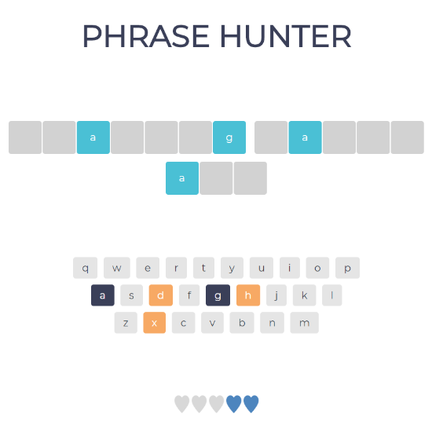

This is the 4th project that I've done during my training as a developer in the Teechdegree Fullstack Javascript.

Browser-based, word guessing game: "Phrase Hunter."

* Using the supplied HTML and CSS files as you can see in the first commit I added ALL the JavaScript code and I used OOP (Object-Oriented Programming) to select a random, hidden phrase, which a player tries to guess, by clicking letters on an onscreen keyboard.
* I created two JavaScript classes with specific properties and methods. I created a Game class for managing the game, and a Phrase class to help with creating an array of Phrase objects.
* The code will cchoose a random phrase, split the phrase into letters, and put those letters onto the gameboard.
* Each time the player guesses a letter, the program compares the letter the player has chosen with the random phrase. If the letter is in the phrase, the gameboard displays the chosen letters on the screen.
* A player continues to select letters until they guess the phrase (and win), or make five incorrect guesses (and lose).
* If the player completes the phrase before they run out of guesses, a winning screen appears. If the player guesses incorrectly five times, a losing screen appears.
* A player can guess a letter only once. After they’ve guessed a letter, the program will disable that letter on the onscreen keyboard.

#### [Know More +](https://github.com/apellicerep/OOP-Js-Game-Show-App)

---

## [List Pagination and Filtering](https://github.com/apellicerep/List-Pagination-and-Filtering)

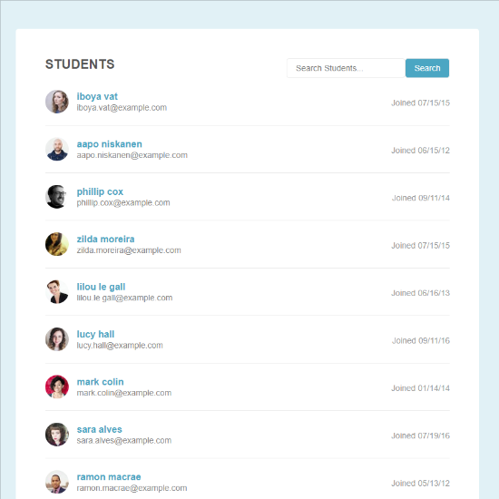

This is the 3th project that I've done during my training as a developer in the Teechdegree Fullstack Javascript.

I enhanced the usability of a web page that is displaying way too much information all at once.

I used an important development principle known as "progressive enhancement". Which in this case basically just means I added JavaScript to enhance the web page, without making the web page dependent upon the JavaScript that you are adding.

Given the html and css of a list of students using Vanilla Javascript:

* I break it up into separate pages that display only 10 students at a time. And programmitcally add buttons to the bottom of the page that allow users to navigate through the list, 10 studnets at a time.
* I added a live filtering to the web.
* The code will work for any list conaining any number of items.

#### [Know More +](https://github.com/apellicerep/List-Pagination-and-Filtering)

---

## [Interactive Form](https://github.com/apellicerep/Interactive_Form)

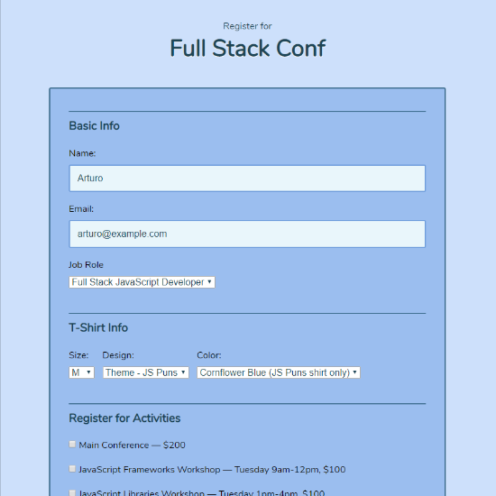

This is the 2th project that I've done during my training as a developer in the Teechdegree Fullstack Javascript.

In this project, I used JavaScript to enhance an interactive registration form.

Using the supplied HTML and CSS files, I added ALL the JavaScript to make the form more user-friendly by:

* adding customized and conditional behavior and interactivity
* validating user input and providing helpful error messages when the user enters invalid information into the form fields.
* Instead of plain "vanilla" JavaScript, I used the popular jQuery library to complete this project to get familiar with this library since it is so common and prevalent on the web.

#### [Know More +](https://github.com/apellicerep/Interactive_Form)

---

## [Random Quote Generator](https://github.com/apellicerep/Random_Quote_Generator)

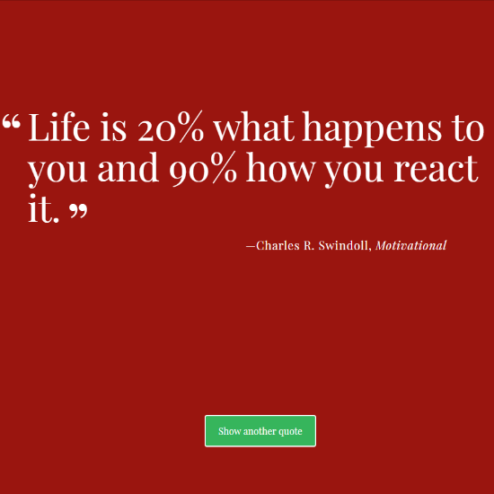

This is the 1th project that I've done during my training as a developer in the Teechdegree Fullstack Javascript.

This project, displays random famous quotes each time a button is clicked, also every interval the backgroundColor and the quotes changes randomly.
#### [Know More +](https://github.com/apellicerep/Random_Quote_Generator)

